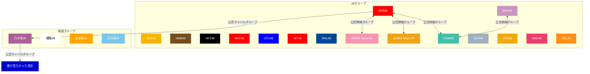

```mermaid
flowchart TD
    subgraph 48グループ
    AKB[AKB48]
    SKE[SKE48]
    NMB[NMB48]
    HKT[HKT48]
    NGT[NGT48]
    STU[STU48]
    JKT[JKT48]
    BNK[BNK48]
    MNL[MNL48]
    SH[AKB48 Team SH]
    TP[AKB48 Team TP]
    CGM[CGM48]
    SDN[SDN48]
    TPE[TPE48]
    SGO[SGO48]
    DEL[DEL48]

    end

    subgraph 坂道グループ
    NOGI[乃木坂46]
    SAKURA[櫻坂46]
    YOSHIMOTO[吉本坂46]
    HINATA[日向坂46]
    end

    BOKUAO[僕が見たかった青空]

    AKB <-- 公式姉妹グループ --> SH
    AKB <-- 公式姉妹グループ --> TP
    AKB <-- 公式姉妹グループ --> CGM
    BNK <-- 公式姉妹グループ --> CGM

    AKB -- 公式ライバルグループ --> NOGI
    NOGI -- 公式ライバルグループ --> BOKUAO

style AKB fill:#FF0000,stroke:#F595B3,color:#FFFFFF
style SKE fill:#F8B500,stroke:#F8B500,color:#FFFFFF
style NMB fill:#744E1C,stroke:#744E1C,color:#FFFFFF
style HKT fill:#000000,stroke:#000000,color:#FFFFFF
style NGT fill:#FF0000,stroke:#FF0000,color:#FFFFFF
style STU fill:#0000FF,stroke:#0000FF,color:#FFFFFF
style JKT fill:#FF0000,stroke:#FF0000,color:#FFFFFF
style BNK fill:#CA95C1,stroke:#CA95C1,color:#FFFFFF
style MNL fill:#004799,stroke:#004799,color:#FFFFFF
style SH fill:#F595B3,stroke:#F595B3,color:#FFFFFF
style TP fill:#EFA315,stroke:#EFA315,color:#FFFFFF
style CGM fill:#45BEAB,stroke:#45BEAB,color:#FFFFFF
style SDN fill:#A0B0C0,stroke:#A0B0C0,color:#FFFFFF
style TPE fill:#EFA913,stroke:#EFA913,color:#FFFFFF
style SGO fill:#E93E6A,stroke:#E93E6A,color:#FFFFFF
style DEL fill:#FE8F15,stroke:#FE8F15,color:#FFFFFF
style NOGI fill:#AA6099,stroke:#AA6099,color:#FFFFFF
style SAKURA fill:#FFFFFF,stroke:#FFFFFF,color:#000000
style YOSHIMOTO fill:#FFA500,stroke:#FFA500,color:#FFFFFF
style HINATA fill:#7BC7E7,stroke:#7BC7E7,color:#FFFFFF
style BOKUAO fill:#0000CD,stroke:#0000CD,color:#FFFFFF
```
