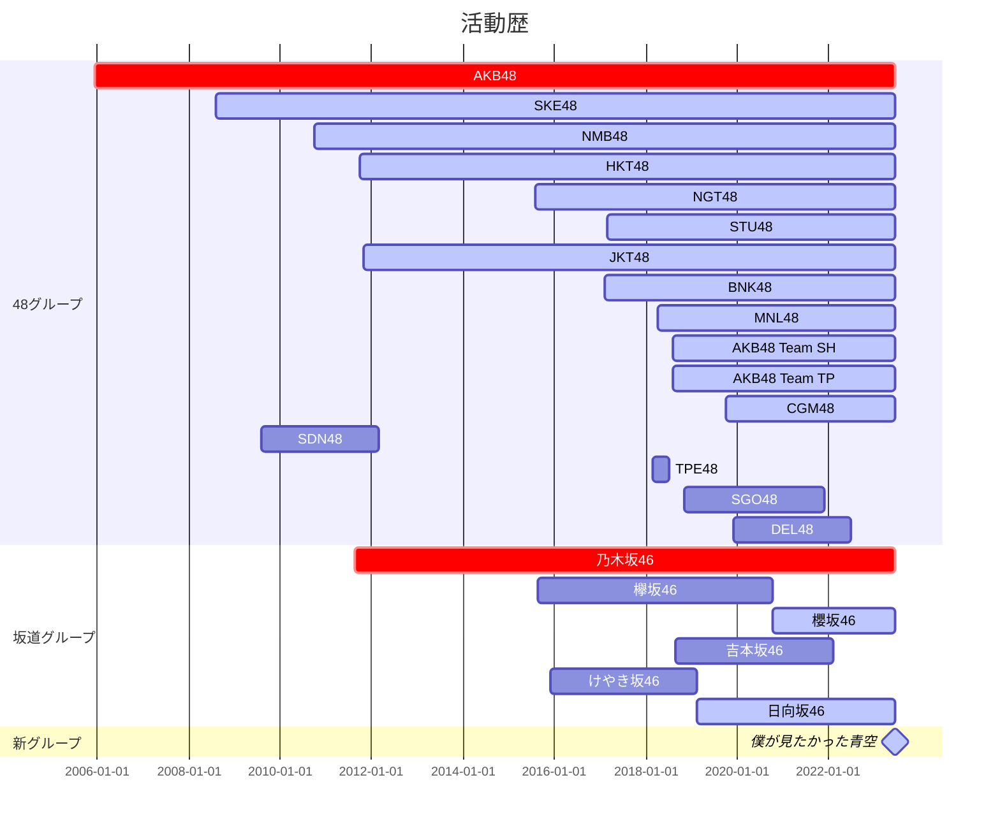

```mermaid
gantt
    title 活動歴
    dateFormat YYYY-MM-DD

    section 48グループ
    AKB48 :crit, a1, 2005-12-08, 2023-06-16
    SKE48 :active, a2, 2008-08-01, 2023-06-16
    NMB48 :active, a3, 2010-10-01, 2023-06-16
    HKT48 :active, a4, 2011-10-01, 2023-06-16
    NGT48 :active, a5, 2015-08-01, 2023-06-16
    STU48 :active, a6, 2017-03-01, 2023-06-16
    JKT48 :active, a7, 2011-11-01, 2023-06-16
    BNK48 :active, a8, 2017-02-01, 2023-06-16
    MNL48 :active, a9, 2018-04-01, 2023-06-16
    AKB48 Team SH :active, a10, 2018-08-01, 2023-06-16
    AKB48 Team TP :active, a11, 2018-08-01, 2023-06-16
    CGM48 :active, a12, 2019-10-01, 2023-06-16
    SDN48 :a13, 2009-08-01, 2012-03-01
    TPE48 :a14, 2018-03-01, 2018-07-01
    SGO48 :a15, 2018-11-01, 2021-12-01
    DEL48 :a16, 2019-12-01, 2022-07-01

    section 坂道グループ
    乃木坂46 :crit, b1, 2011-08-21, 2023-06-16
    欅坂46   :b2, 2015-08-21, 2020-10-13
    櫻坂46   :active, b3, after b2, 2023-06-16
    吉本坂46 :b4, 2018-08-20, 2022-02-05
    けやき坂46 :b5, 2015-11-30, 2019-02-11
    日向坂46 :active, b6, after b5, 2023-06-16

    section 新グループ
    僕が見たかった青空 :milestone,active, c1, 2023-06-15, 2023-06-16
```
